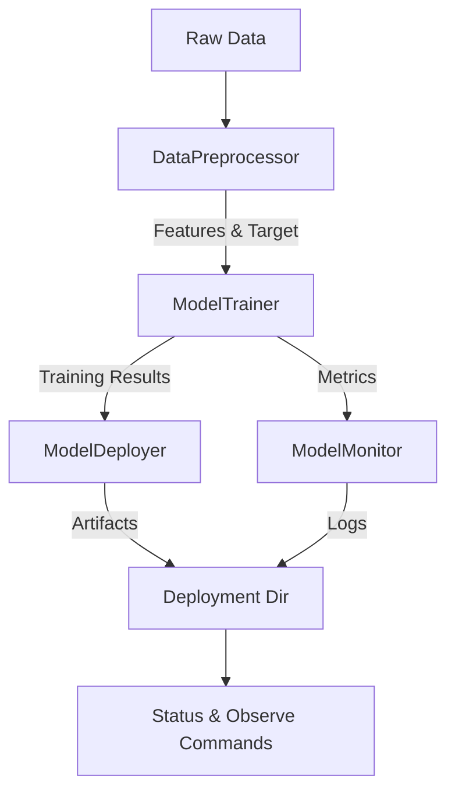

# Pipeline Architecture

Easy MLOps centers around the `MLOpsPipeline` orchestrator (`easy_mlops/pipeline.py`). The pipeline coordinates four core components:

1. **Configuration (`Config`)** – Loads defaults and optional YAML overrides.
2. **Preprocessing (`DataPreprocessor`)** – Cleans and prepares input data.
3. **Training (`ModelTrainer`)** – Detects the problem type, trains a model, and evaluates performance.
4. **Deployment (`ModelDeployer`)** – Persists artifacts and optionally creates an endpoint script.
5. **Observability (`ModelMonitor`)** – Logs metrics and predictions, and produces monitoring summaries.

## Stage Details

### Preprocessing

- Supports CSV, JSON, and Parquet inputs.
- Handles missing data (`drop`, `mean`, `median`, `mode`).
- Label-encodes categorical columns and scales numeric features (configurable).
- Captures feature column names and the target column for downstream use.

### Training

- Automatically detects classification vs. regression by inspecting the target distribution.
- Supports automatic model selection (`RandomForestRegressor`/`Classifier`) and explicit choices (`logistic_regression`, `linear_regression`, `random_forest_*`).
- Performs train/test splitting (stratified for classification) and cross-validation (configurable folds).
- Computes metrics:
  - Classification: accuracy, weighted F1.
  - Regression: MSE, RMSE, R².

### Deployment

- Creates timestamped deployment directories under `models/` by default.
- Persists the trained model, preprocessor, and metadata (JSON).
- Optional endpoint script (`predict.py`) allows command-line inference with saved artifacts.

### Observability

- Logs metrics and predictions with timestamps and model versions.
- Supports metric threshold checks for alerting decisions (consumer code can react accordingly).
- Exposes summaries used by `status` and `observe` commands, and writes logs to `logs/`.

## Extending the Pipeline

Potential extension points:

- **Custom preprocessing** – Inherit from `DataPreprocessor` or modify configuration to disable scaling/encoding and plug in custom transformers.
- **Additional models** – Extend `ModelTrainer.select_model` to add new estimators and expose them via configuration.
- **Deployment targets** – Replace or wrap `ModelDeployer` to publish to cloud endpoints or registries.
- **Monitoring sinks** – Modify `ModelMonitor` to forward logs to external observability platforms.

See [`development.md`](development.md) for guidance on contributing changes safely.
